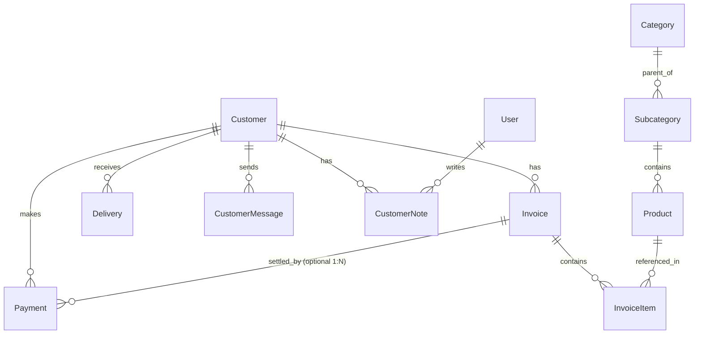

# نقشه جامع وضعیت جاری سیستم — خوش‌صنعت پایدار
## CURRENT_SYSTEM_MAP.md — نقشه‌برداری عملیاتی و ساختاری

**تاریخ تهیه:** مهر ۱۴۰۵ (سپتامبر ۲۰۲۶)  
**معمار سیستم:** Senior Software Architect / ERP Product Architect  

---

### ۱. ماژول‌های موجود (Existing Modules)

1. **ماژول پورتال مدیریت ادمین (Khoshmin Admin):**
   - پیشخوان اصلی و آمار کلیدی
   - مدیریت کاربران و پرسنل دسترسی
   - تنظیمات عمومی سایت و ویرایش متن‌ها
   - مدیریت فایل‌ها و رسانه‌های آپلودی در MinIO
   - آنالیتیکس و رهگیری بازدیدکنندگان سایت
   - مرکز ایمیل‌های سیستمی و اعلانات

2. **ماژول مشتریان و ارتباطات تجاری (Customer Management):**
   - پرونده اطلاعات هویتی و ثبتی مشتریان
   - ثبت یادداشت‌های ادمین و وضعیت خوانده‌شدن
   - دریافت پیام‌های ورودی مشتریان از فرم‌های تماس
   - ثبت فاکتورهای فروش و صدور اسناد
   - ثبت دریافتی‌ها و فیش‌های بانکی/نقدی
   - ثبت فرم‌های خروج و تحویل بار همراه با امضای دیجیتال

3. **ماژول کاتالوگ محصولات و مهندسی (Products & Categories):**
   - دسته‌بندی‌ها و زیردسته‌بندی‌های قطعات ساختمانی
   - اطلاعات متالورژی اولیه (کد کالا، وزن واحد استاندارد، واحد سنجش، شناسه مودیان ۱۳ رقمی)
   - گالری تصاویر و فایل کاتالوگ PDF

4. **ماژول پروژه‌ها و نمونه‌کارها (Projects & Showcase):**
   - معرفی پروژه‌های اجرایی نمای خشک، کرتین‌وال، لوور، هندریل و براکت‌ها
   - گالری و توضیحات فنی مهندسی

5. **ماژول مقالات و آموزش (Education & Knowledge):**
   - مقالات تخصصی مهندسی نما و اتصالات ساختمانی
   - مدیریت محتوا با ادیتور Tiptap

6. **ماژول خدمات هسته ERP (پیاده‌سازی شده در کد / در انتظار اتصال دیتابیس):**
   - `lib/accounting/voucher-service.ts`: موتور صدور اسناد دوبل و دفاتر روزنامه و کل
   - `lib/warehouse/inventory-service.ts`: انبارداری چهارگانه و کاردکس میانگین موزون
   - `lib/costing/job-costing-service.ts`: بهای تمام‌شده سفارش کار، تخصیص مستقیم و کسر قراضه
   - `lib/payroll/tax-diskette-service.ts`: فایل‌های سه‌گانه ماده ۸۶ مالیات حقوق
   - `lib/tax/verhoeff.ts`: محاسبات ورهوف و شناسه ۲۲ رقمی مودیان
   - `app/api/agent`: درگاه هوشمند ثبت باسکول و حواله انبار

---

### ۲. صفحات وب موجود (Existing Pages)

#### الف) بخش عمومی (Public Website):
- `/`: صفحه اصلی سایت (هیرو اسلایدر، معرفی محصولات، پروژه‌ها، چرا ما، تماس)
- `/about`: درباره شرکت مهندسی خوش‌صنعت پایدار
- `/contact`: فرم تماس و اطلاعات ارتباطی
- `/products`: کاتالوگ و کاوشگر کلیه محصولات صنعتی
- `/products/[slug]`: مشخصات فنی، گالری و کاتالوگ قطعه خاص
- `/projects`: فهرست پروژه‌های مهندسی اجرا شده
- `/projects/[id]`: مشخصات فنی و گالری پروژه
- `/education`: مقالات آموزشی و پایگاه دانش فنی
- `/education/[id]`: متن کامل مقاله و مستندات فنی
- `/login`: صفحه ورود ایمن ادمین با اعتبارسنجی دو مرحله‌ای و حفاظت Brute Force

#### ب) بخش مدیریت (Admin Panel - `/khoshmin`):
- `/khoshmin/dashboard`: پیشخوان مرکزی ادمین
- `/khoshmin/customers`: فهرست جامع مشتریان با فیلتر بدهکار/بستانکار و جستجو
- `/khoshmin/customers/new`: فرم تعریف مشتری حقیقی یا حقوقی جدید
- `/khoshmin/customers/[id]`: صفحه پرونده مشتری (شامل تب‌های ۶ گانه: اطلاعات، پیام‌ها، یادداشت‌ها، فاکتورها، پرداختی‌ها، تحویل بار)
- `/khoshmin/customers/[id]/deliveries/new`: صفحه ثبت فرم تحویل بار جدید با آپلود امضا و اسناد
- `/khoshmin/products`: مدیریت محصولات و قطعات
- `/khoshmin/projects`: مدیریت پروژه‌ها و گالری‌ها
- `/khoshmin/education`: مدیریت مقالات فنی
- `/khoshmin/slider`: مدیریت اسلایدر اصلی صفحه نخست
- `/khoshmin/media`: مدیریت متمرکز فایل‌های آپلود شده در MinIO
- `/khoshmin/texts`: مدیریت متون و برچسب‌های عمومی سایت
- `/khoshmin/users`: مدیریت دسترسی پرسنل و ادمین‌ها
- `/khoshmin/emails`: ارسال ایمیل گروهی و تنظیمات SMTP
- `/khoshmin/analytics`: مشاهده رفتار بازدیدکنندگان و آمار ترافیک

---

### ۳. نقاط پایانی API موجود (Existing API Endpoints)

| مسیر API | متدها | شرح عملکرد | وضعیت احراز هویت |
|---|---|---|---|
| `/api/auth` | GET, POST | ورود، خروج، ثبت‌نام، بازیابی رمز و سشن | آزاد / کوکی `admin_token` |
| `/api/upload` | POST, DELETE | آپلود و حذف مستقیم فایل از MinIO S3 | نیازمند ادمین |
| `/api/khoshmin/customers` | GET, POST | دریافت لیست مشتریان و ایجاد مشتری جدید | نیازمند ادمین |
| `/api/khoshmin/customers/[id]` | GET, PUT, DELETE | دریافت، ویرایش و حذف پرونده مشتری | نیازمند ادمین |
| `/api/khoshmin/customers/[id]/counts` | GET | شمارش پیام‌ها، فاکتورها، پرداخت‌ها و تحویل‌ها | نیازمند ادمین |
| `/api/khoshmin/customers/[id]/invoices` | GET, POST, PUT, DELETE | مدیریت فاکتورهای فروش مشتری | نیازمند ادمین |
| `/api/khoshmin/customers/[id]/payments` | GET, POST, PUT, DELETE | مدیریت پرداختی‌ها و فیش‌های واریزی مشتری | نیازمند ادمین |
| `/api/khoshmin/customers/[id]/deliveries`| GET, POST, PUT, DELETE | مدیریت حواله‌ها و فرم‌های تحویل بار مشتری | نیازمند ادمین |
| `/api/khoshmin/customers/[id]/recalculate-debt`| POST | محاسبه مجدد بدهی/بستانکاری مشتری از فاکتورها و پرداخت‌ها | نیازمند ادمین |
| `/api/khoshmin/customers/[id]/messages`| GET, POST, PATCH, DELETE | تیکت‌ها و پیام‌های ورودی مشتری | نیازمند ادمین |
| `/api/khoshmin/customers/[id]/notes` | GET, POST, DELETE | یادداشت‌های داخلی کارشناسان درباره مشتری | نیازمند ادمین |
| `/api/khoshmin/customers/[id]/mark` | PATCH | علامت‌گذاری پیام‌ها یا یادداشت‌ها به عنوان خوانده شده | نیازمند ادمین |
| `/api/khoshmin/customers/stats` | GET | آمار کلی مشتریان، جمع مطالبات و وصولی‌ها | نیازمند ادمین |
| `/api/agent/chat` | POST | پردازش فرامین گفتگوی هوشمند (ثبت باسکول و مصالح) | آزاد با توکن |
| `/api/agent/confirm` | POST | تایید و ثبت نهایی حواله خروج انبار یا مصرف خط | آزاد با توکن |
| `/api/products` | GET, POST | دریافت و ثبت محصولات کاتالوگ | عمومی / ادمین |
| `/api/products/[id]` | GET, PUT, DELETE | جزئیات، ویرایش و حذف محصول | عمومی / ادمین |
| `/api/categories` | GET, POST | دسته‌بندی‌های اصلی محصولات | عمومی / ادمین |
| `/api/subcategories` | GET, POST | زیردسته‌بندی‌های فنی | عمومی / ادمین |
| `/api/projects` | GET, POST | فهرست و ایجاد پروژه‌ها | عمومی / ادمین |
| `/api/projects/[id]` | GET, PUT, DELETE | جزئیات، ویرایش و حذف پروژه | عمومی / ادمین |
| `/api/education` | GET, POST | مقالات فنی | عمومی / ادمین |
| `/api/education/[id]` | GET, PUT, DELETE | جزئیات و ویرایش مقاله | عمومی / ادمین |
| `/api/users` | GET, POST, PUT, DELETE | مدیریت کاربران سیستم و پرمیشن‌ها | فقط MAIN_ADMIN |
| `/api/track` | POST | ثبت متادیتای بازدید کاربران برای آنالیتیکس | عمومی |

---

### ۴. جداول پایگاه داده موجود و ساختار فیزیکی (Database Tables)

#### الف) جداول احراز هویت و دسترسی:
- **`user`:** شناسه، نام، ایمیل، کلمه عبور هش‌شده، نقش (`role: MAIN_ADMIN | CONTENT_ADMIN`)، وضعیت (`status`)، مسیرهای مجاز (`allowedPaths`).
- **`verificationtoken`:** توکن‌ها و کدهای یکبارمصرف ایمیلی (OTP) جهت ورود و بازیابی کلمه عبور با تاریخ انقضا و تعداد تلاش.

#### ب) جداول تجاری، مشتری و فروش:
- **`customer`:** شناسه، نام، ایمیل، تلفن، آدرس، شرکت، کدملی، وضعیت، `totalDebt` (Double)، `totalPaid` (Double)، شمارنده پیام‌ها.
- **`customermessage`:** پیام‌های ارسالی مشتری از پورتال یا وبسایت، پاسخ ادمین و وضعیت مطالعه.
- **`customernote`:** یادداشت‌های داخلی مسئولین فروش و مالی درباره مشتری.
- **`invoice`:** فاکتور فروش شامل `invoiceNo`، شناسه مشتری، مبالغ `amount`, `discount`, `tax`, `finalAmount`, `paidAmount` (همگی Double)، وضعیت فاکتور، تاریخ صدور، سررسید و آدرس پیوست فاکتور در MinIO.
- **`invoiceitem`:** اقلام فاکتور شامل شناسه کالا، عنوان، تعداد، قیمت واحد، تخفیف، نرخ ارزش افزوده و مبلغ نهایی ردیف.
- **`payment`:** پرداختی‌ها شامل شناسه مشتری، شناسه فاکتور اختیاری (`invoiceId`)، مبلغ `amount` (Double)، شیوه پرداخت (`CASH | CHECK | CARD | TRANSFER | OTHER`)، شماره فیش/رسید، توضیحات و فایل پیوست فیش.
- **`delivery`:** تحویل بار شامل شناسه مشتری، شماره حواله (`deliveryNo`)، نام کالا (`productName` به عنوان رشته)، مقدار (`quantity` به صورت Double)، واحد سنجش، تاریخ تحویل، وضعیت، توضیحات، آدرس تصویر امضا و فایل‌های پیوست JSON.

#### ج) جداول کاتالوگ مهندسی و بازاریابی:
- **`category`** و **`subcategory`:** ساختار درختی گروه‌های کالایی صنعتی.
- **`product`:** قطعات ساختمانی شامل کد کالا، عنوان، اسلاگ، توضیحات، آدرس تصویر، شناسه مودیان ۱۳ رقمی، وزن محاسباتی استاندارد بر اساس باسکول و پرچم مواد اولیه.
- **`project`** و **`projectcategory`:** پروژه‌های مهندسی اجرایی.
- **`article`** و **`articlecategory`:** مقالات و دانشنامه فنی.
- **`slide`** و **`slidersettings`:** اسلایدر و بنرهای تبلیغاتی.
- **`logo`**, **`contact`**, **`setting`**, **`visitlog`**, **`emaillog`**.

---

### ۵. روابط موجود میان جداول (Existing Relations)

---

### ۶. احراز هویت و سطوح دسترسی جاری (Authentication & Permissions)

- **احراز هویت:** کوکی HTTP-Only با نام `admin_token` حاوی توکن امضا شده با کتابخانه `jose` (الگوریتم HS256) با انقضای ۷ روزه.
- **سطوح کاربری موجود:**
  - `MAIN_ADMIN`: دسترسی نامحدود به کلیه بخش‌ها و ماژول‌ها.
  - `CONTENT_ADMIN` و سایر نقش‌ها: فیلترسازی بر اساس مسیرهای متنی درون ستون `allowedPaths` (مثلاً: `"/khoshmin/customers,/khoshmin/products"`).
- **نقاط ضعف:**
  - فاقد مکانیزم نقش‌محور ریزدانه (Fine-grained RBAC).
  - هیچ کنترلی روی اکشن‌های درون صفحه (مثل حق تایید، حق قطعی‌سازی سند، حق ابطال فاکتور، یا ویرایش وزن باسکول) وجود ندارد.
  - فاقد اصل ۴ چشم (Maker-Checker Principle) برای تراکنش‌های مالی و خروج کالا.

---

### ۷. منطق حسابداری موجود (Existing Accounting Logic)

- **وضعیت فعلی در پایگاه داده عملیاتی:** هیچ سند حسابداری دوبلی (Journal Voucher) به صورت خودکار یا دستی در پایگاه داده MySQL ثبت نمی‌شود. جداول `Account`, `JournalVoucher`, `JournalEntry` هنوز فیزیکی ساخته نشده‌اند.
- **وضعیت در لایه کد (`lib/accounting/voucher-service.ts`):**
  - متد `createVoucher`: اعتبارسنجی ریاضی توازن Debit = Credit و ممنوعیت ارقام منفی و ایجاد آرتیکل‌های متوالی با شماره سند افزایشی.
  - متد `finalizeVoucher`: قفل کردن سند از حالت DRAFT به FINALIZED.
  - متد `getTrialBalance`: تولید تراز آزمایشی ۴ ستونی با جمع گردش و مانده بدهکار/بستانکار.
- **شکاف اصلی:** بین رویدادهای مالی (فاکتور، دریافت پول، تحویل کالا) و صدور سند روزنامه پیوندی وجود ندارد.

---

### ۸. منطق محاسبه مانده مشتری (Customer Balance Logic)

- **محل محاسبه:**
  1. در مسیر API `/api/khoshmin/customers/[id]/recalculate-debt`
  2. در توابع درون‌خطی `syncCustomerBalance` در روت‌های Invoices و Payments
  3. در سمت کلاینت درون کامپوننت `FinancialSummaryCards.tsx`
- **فرمول محاسباتی:**
  $$\text{Total Invoices} = \sum (\text{Invoice.finalAmount}) \quad \text{for Invoices where status} \neq \text{'CANCELLED'}$$
  $$\text{Total Paid} = \sum (\text{Payment.amount})$$
  $$\text{Total Debt} = \text{Total Invoices} - \text{Total Paid}$$
- **رفتار عددی:**
  - اگر $\text{Total Debt} > 0$ باشد: مشتری **بدهکار** است (نمایش قرمز در کارت).
  - اگر $\text{Total Debt} < 0$ باشد: مشتری **بستانکار / دارای پیش‌پرداخت** است (نمایش فیروزه‌ای/سبز).
  - اگر $\text{Total Debt} = 0$ باشد: حساب **تسویه کامل** است.
- **نقص بحرانی:** مقدار مانده به صورت یک ستون استاتیک (`totalDebt`) در رکورد مشتری ذخیره و مرتباً بازنویسی می‌شود، در حالی که در استانداردهای ERP صنعتی مانده مشتری باید از معین دفتر دریافتنی‌ها (Accounts Receivable Subsidiary Ledger) استخراج یا از یک Projection امن بازسازی گردد.

---

### ۹. منطق فاکتور فروش (Existing Invoice Logic)

- تولید شناسه فاکتور: با الگوی `INV-000001` از طریق شمارش آخرین شناسه ثبت‌شده.
- مبالغ فاکتور:
  $$\text{finalAmount} = \max(0, \text{amount} - \text{discount} + \text{tax})$$
- اتصال با پرداختی‌ها:
  - هر پرداختی می‌تواند یک `invoiceId` اختیاری داشته باشد.
  - وضعیت فاکتور به صورت خودکار بر مبنای مجموع مبالغ پرداختی‌های متصل محاسبه می‌شود:
    - اگر $\sum \text{Paid} \ge \text{finalAmount}$: وضعیت `PAID`
    - اگر $\sum \text{Paid} > 0$: وضعیت `PARTIAL`
    - اگر سررسید گذشته باشد: وضعیت `OVERDUE`
    - در غیر این صورت: وضعیت `PENDING`
- اقلام فاکتور (`InvoiceItem`): مدال ثبت سریع فاکتور تنها یک سطر فیک بر اساس توضیحات فاکتور با تعداد ۱ ایجاد می‌کند و اتصال به کاتالوگ دقیق محصولات برقرار نیست.

---

### ۱۰. منطق تحویل بار و بارنامه (Existing Delivery & Waybill Logic)

- تحویل بار به صورت یک فرم مستقل با فیلدهای متنی ساده (`productName`, `quantity`, `unit`, `deliveryDate`) ثبت می‌شود.
- امضای دیجیتال تحویل‌گیرنده و فایل‌های مدارک بار در MinIO ذخیره می‌شوند.
- **فقدان بارنامه رسمی (Waybill):** بارنامه‌های بین‌شهری، اطلاعات ناوگان حمل، شماره پلاک، راننده، کرایه حمل و شرکت باربری وجود ندارند.
- **فقدان قبض باسکول (Scale Ticket):** وزن پر و خالی تریلی، توزین الکترونیکی و خطای رواداری باسکول در تحویل بار ثبت نمی‌شود.
- **فقدان تخصیص فاکتور (Allocation):** تحویل بار مستقلاً ثبت می‌شود و مشخص نیست این ۲۳ عدد قطعه تحویل‌شده مربوط به کدام ردیف کدام فاکتور است.

---

### ۱۱. بدهی فنی شناخته‌شده (Known Technical Debt)

1. **انحراف شدید اسکیمای دیتابیس (Schema Drift):** کدهای تایپ‌اسکریپت و مدل‌های پریزما با ساختار فیزیکی دیتابیس MySQL همگام نیستند.
2. **استفاده از نوع داده Float/Double:** استفاده از Float برای فاکتور، پرداخت و بدهی مشتری، در صورت محاسبات با مبالغ بالای صنعتی (میلیاردی)، خطای تقریب ریالی به بار می‌آورد.
3. **عدم ایمنی در تولید شماره اسناد (Race Conditions):** شماره‌گذاری فاکتورها، رسیدها و تحویل‌ها با `findFirst({ orderBy: { id: 'desc' } })` انجام می‌شود و در تراکنش‌های همزمان تصادم خواهد کرد.
4. **عدم وجود سیستم تست:** پروژه فاقد بسته‌های تست استاندارد (مانند Vitest یا Jest) و فاقد حتی یک تست اتوماتیک است.
5. **ارتباط ۱ به N صلب میان فاکتور و پرداخت:** یک پرداخت نمی‌تواند به دو فاکتور تخصیص یابد و تسویه فاکتور با چند چک یا حواله مختلف مکانیزم شفافی در پایگاه داده ندارد.

---

### ۱۲. ریسک‌ها (Operational & Architectural Risks)

- **ریسک یکپارچگی داده‌ها (Data Integrity):** با حذف یک مشتری، فاکتورها و مدارک مالی وی کسکید شده و ناپدید می‌شوند.
- **ریسک ممیزی مالیاتی:** فاکتورهای فروش در دیتابیس قابل ویرایش مستقیم هستند و ردپای تغییرات (Audit Trail) ذخیره نمی‌شود.
- **ریسک کسری و مغایرت انبار:** خروج بار هیچ اثری روی موجودی انبار نمی‌گذارد که باعث مغایرت میان موجودی واقعی کارخانه و اسناد سیستم خواهد شد.

---

### ۱۳. ریسک‌های مایگریشن (Migration Risks)

- **حفظ ۱۰۰ درصدی داده‌های واقعی فعلی:** مشتری شناسه ۴ با مانده بدهی ۴,۴۹۵,۴۰۹- تومان، ۳ فاکتور ثبت‌شده و ۲ پرداخت واقعی نباید دچار تغییر مبلغ شوند.
- **عدم قطعی در سیستم آپلود MinIO:** پیوندهای امضا و پیوست‌های تحویل موجود در باکت MinIO باید دقیقاً در ساختار جدید نگهداری و محافظت شوند.
