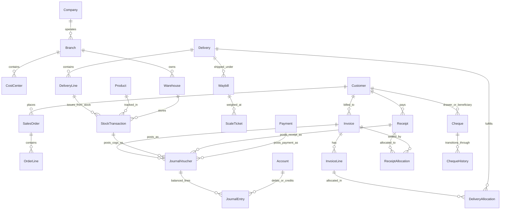

# مستند رسمی تسک‌های فاز صفر — خوش‌صنعت پایدار
## PHASE 0: SYSTEM AUDIT & FOUNDATION BLUEPRINT (TASK-0001 TO TASK-0011)

**پروژه:** سیستم جامع سازمانی و ERP تحت وب شرکت خوش‌صنعت پایدار  
**معمار ارشد:** Senior Software Architect, ERP Product Architect & Lead Test Engineer  
**تاریخ تکمیل فاز صفر:** مهر ۱۴۰۵ (سپتامبر ۲۰۲۶)

---

## TASK-0001: Repository Audit (ممیزی مخزن کد و پشته نرم‌افزاری)

### هدف و چرایی (Goal & Why)
بررسی جامع کلیه فایل‌ها، پکیج‌ها، متغیرهای محیطی، تنظیمات بیلدر و اسکریپت‌های اجرایی برای شناسایی معماری و زیرساخت فعلی بدون تخریب کدهای موجود.

### یافته‌های ممیزی (Audit Findings)
1. **فریم‌ورک و هسته اجرا:**
   - فریم‌ورک Next.js نسخه 16.2.4 با معماری App Router.
   - لایبرری React نسخه 19.2.4 (استفاده از Promise Params با هوک `use(params)`).
   - تایپ‌اسکریپت نسخه 5.9.3 (کامپایل `npx tsc --noEmit` با موفقیت کامل و بدون هیچ خطای تایپی انجام شد).
   - پکیج استایل‌دهی: Tailwind CSS v4.0 مبتنی بر توکن‌های طراحی `DESIGN.md`.
2. **پایگاه داده و اتصالات:**
   - کلاینت Prisma ORM نسخه 5.22.0.
   - پایگاه داده لوکال MySQL فعال روی پورت ۳۳۰۶ (`mysql://root:@localhost:3306/ks_database`).
3. **ذخیره‌سازی فایل و رسانه:**
   - اتصال به سرور آبجکت استوریج MinIO بر بستر پروتکل AWS S3 باکت `khoshsanat-media` در `lib/minio.ts`.
   - توابع جامع امنیتی شامل اعتبارسنجی URL، استخراج خودکار کلید، آپلود فایل‌های امضا و پیوست و پاکسازی تفاضلی فایل‌های حذف شده.
4. **سرویس‌های جانبی و AI Gateway:**
   - اسکریپت `run_dev.bat` که سرویس‌های Next.js، درگاه AI محلی 9router روی پورت ۲۰۱۳۱ و بات تلگرام هرمس (@Kh_Co_Bot) را به صورت یکپارچه اجرا می‌کند.

---

## TASK-0002: Current Database Audit (ممیزی دیتابیس فعلی و Schema Drift)

### هدف و چرایی (Goal & Why)
بررسی ساختار واقعی پایگاه داده فیزیکی MySQL در مقایسه با شمای مدلسازی‌شده در Prisma جهت کشف شکاف‌ها و تداخل‌ها.

### یافته‌های ممیزی
1. **تعداد جداول فیزیکی فعال در MySQL:** ۲۴ جدول.
2. **کشف انحراف شدید اسکیمای دیتابیس (Schema Drift):**
   - جداول `Account`, `JournalVoucher`, `JournalEntry`, `Warehouse`, `StockTransaction`, `BOM`, `BOMItem`, `ProductionOrder`, `Employee`, `PayrollSlip` در فایل `prisma/schema.prisma` تعریف شده‌اند اما هنوز دستور مایگریشن روی دیتابیس فیزیکی اجرا نشده و این جداول در دیتابیس واقعی ساخته نشده‌اند!
   - فیلدهای `economicCode` و `postalCode` در مدل `Customer` در کد اضافه شده اما در جدول فیزیکی MySQL وجود ندارد؛ که منجر به خطای Prisma در کوئری‌های فچ مشتریان می‌شد.
3. **موجودی رکوردهای واقعی:**
   - مشتریان: ۱ رکورد (شناسه ۴، نام "aasdasd")
   - فاکتورها: ۳ رکورد با جمع نهایی ۵۱,۰۴۵ تومان
   - پرداخت‌ها: ۲ رکورد با جمع ۴,۵۴۶,۴۵۴ تومان (مانده: ۴,۴۹۵,۴۰۹- تومان بستانکار)
   - تحویل بار: ۱ رکورد (شناسه ۵، مقدار ۲۳ عدد، دارای امضا و پیوست)
4. **تهیه نسخه پشتیبان امن (Pre-Migration Backup):**
   - دامپ کامل دیتابیس فیزیکی تهیه و در فایل `backups/ks_database_backup_pre_migration.sql` (حجم ۶۰ کیلوبایت) ثبت شد.

---

## TASK-0003: Current Customer Page Audit (ممیزی صفحه و پرونده مشتری)

### وضعیت جاری
- روت‌ها: `/khoshmin/customers` (فهرست) و `/khoshmin/customers/[id]` (جزئیات پرونده).
- ساختار تب‌ها در `TabsNavigation.tsx`:
  - `info`: مشخصات ثبتی و هویتی
  - `messages`: پیام‌های ورودی مشتری از سایت
  - `notes`: یادداشت‌های داخلی اپراتورها
  - `invoices`: فاکتورهای فروش صادر شده
  - `payments`: رسیدهای واریز وجه و فیش‌ها
  - `deliveries`: فرم‌های تحویل بار و خروج کالا
- **نقایص و آسیب‌پذیری‌ها:**
  - امکان حذف فیزیکی (Cascade Delete) که تمام فاکتورها، رسیدها و فایل‌های پیوست مشتری را پاک می‌کند.
  - فقدان تب‌های لاجستیک، باسکول، تحلیل سنی مطالبات، چک‌های در جریان، و تفصیلی حسابداری در پرونده مشتری.

---

## TASK-0004: Current Invoice Audit (ممیزی ساختار فاکتورها)

### ساختار جاری فاکتورها
- مدل: `Invoice` با ستون‌های `invoiceNo`, `amount`, `discount`, `tax`, `finalAmount`, `status`, `dueDate`, `paidAmount`, `attachmentUrl`.
- ایجاد اقلام: از طریق مدال سریع `CreateInvoiceModal.tsx` که به ازای هر فاکتور یک ردیف متنی فیک در `InvoiceItem` می‌سازد.
- نحوه تسویه: جمع زدن سطحی `payments` متصل به فاکتور و تغییر خودکار وضعیت به `PAID`، `PARTIAL` یا `OVERDUE`.
- **نقایص:**
  - مبالغ اعشاری با نوع `Double` ذخیره می‌شوند نه `Decimal`.
  - شماره‌گذاری `INV-000001` غیرهمزمان است و ریسک تداخل در تراکنش‌های همزمان دارد.
  - فاقد ارتباط با بارنامه و حواله‌های خروج انبار.

---

## TASK-0005: Current Waybill & Delivery Audit (ممیزی تحویل بار و بارنامه)

### وضعیت جاری
- جدول `delivery` دارای فیلدهای سطحی: `productName` (رشته متنی ساده)، `quantity` (عدد اعشاری)، `unit`، `deliveryDate`، `signatureUrl` (تصویر امضا در MinIO) و `attachments` (پیوست‌ها در MinIO).
- **شکاف‌های بنیادین با الزامات کارخانه فولادی:**
  1. هیچ فیلدی برای توزین باسکول (وزن پر، خالی، خالص، خطای رواداری) وجود ندارد.
  2. ناوگان، راننده، شماره پلاک، شرکت حمل‌ونقل و بارنامه بین‌شهری ثبت نمی‌شود.
  3. تحویل بار به هیچ ردیف فاکتوری تخصیص داده نمی‌شود و امکان کنترل تحویل مازاد (Over-delivery) وجود ندارد.
  4. هیچ حواله خروجی از انبار قطعات ساخته‌شده صادر نمی‌شود.

---

## TASK-0006: Current Balance Calculation Audit (ممیزی منطق مانده مشتری)

### وضعیت و فرمول محاسباتی فعلی
$$\text{Customer Balance} = \sum \text{Invoice.finalAmount} - \sum \text{Payment.amount}$$
- محل‌های اجرای فرمول:
  1. API مسیر `/api/khoshmin/customers/[id]/recalculate-debt`
  2. کامپوننت فرانت‌اند `FinancialSummaryCards.tsx`
  3. ستون‌های استاتیک `totalDebt` و `totalPaid` در جدول `Customer`
- **ایرادات بنیادین معماری:**
  - مانده مشتری نباید در یک ستون استاتیک قابل تغییر دستی ذخیره شود.
  - مانده باید برگرفته از معین حساب دریافتنی‌ها (Accounts Receivable Ledger) با تفصیلی مشتری یا یک Projection امن و قابل بازسازی از روی ریز تراکنش‌ها باشد.

---

## TASK-0007: Current Authentication & Permission Audit (ممیزی دسترسی و امنیت)

### وضعیت فعلی
- احراز هویت با کوکی `admin_token` امضا شده با کتابخانه `jose` (JWT).
- نقش‌های کاربری: فقط دو نقش `MAIN_ADMIN` و `CONTENT_ADMIN`.
- سیستم فیلتر دسترسی: مبتنی بر تطبیق مسیر URL در ستون `allowedPaths` رشته‌ای.
- **شکاف‌ها:**
  - فاقد سیستم دسترسی ریزدانه مبتنی بر عملیات (Create, Read, Edit, Approve, Post, Cancel, Export).
  - فاقد تفکیک وظایف (Maker-Checker) برای تایید فاکتورهای سنگین، خروج بار، و صدور سند حسابداری.

---

## TASK-0008: Accounting Architecture Design (طراحی هسته حسابداری دوبل)

### اصول معماری نهایی
1. **درخت کدینگ حساب‌ها (Chart of Accounts):**
   - سطح ۱: گروه حساب‌ها (دارایی‌های جاری، دارایی‌های غیرجاری، بدهی‌های جاری، بدهی‌های غیرجاری، حقوق صاحبان سهام، درآمدها، بهای تمام‌شده، هزینه‌ها)
   - سطح ۲: حساب کل (بانک‌ها، حساب‌های دریافتنی تجاری، موجودی کالا و مواد، اسناد پرداختنی، درآمد فروش، ...)
   - سطح ۳: حساب معین (معین مشتریان، معین بانک‌های ریالی، معین تنخواه، معین مالیات بر ارزش افزوده، ...)
   - شناور تفصیلی: تفصیلی ۱ (اشخاص / مشتریان / تامین‌کنندگان)، تفصیلی ۲ (مراکز هزینه / سفارش‌های ساخت)
2. **نامتغیرهای سند حسابداری (Invariants):**
   $$\sum \text{Debit} = \sum \text{Credit}$$
   $$\text{Debit} \ge 0, \quad \text{Credit} \ge 0, \quad \text{Debit} > 0 \oplus \text{Credit} > 0$$
3. **چرخه عمر اسناد:** `DRAFT` $\rightarrow$ `VERIFIED` $\rightarrow$ `FINALIZED`.
4. **تغییرناپذیری (Immutability):** سند قطعی حسابداری حذف یا ویرایش مستقیم نمی‌شود. اصلاح فقط با سند برگشت (Reversal Voucher) یا سند اصلاحی (Adjustment Voucher) صورت می‌پذیرد.
5. **موتور نگاشت حسابداری (Accounting Mapping Engine):** عدم هاردکد کردن شناسه‌ها؛ نگاشت حساب‌ها بر اساس نوع رویداد، گروه محصول، انبار، و مرکز هزینه.

---

## TASK-0009: Target ERD (نمودار موجودیت-رابطه هدف)

---

## TASK-0010: Migration Strategy (استراتژی مهاجرت بدون قطعی و موازنه ۱۰۰٪)

### برنامه ۸ مرحله‌ای مهاجرت داده‌ها:
1. **تهیه نسخه پشتیبان فیزیکی (انجام شد):**
   - فایل دامپ `backups/ks_database_backup_pre_migration.sql` تهیه و تایید شد.
2. **تطبیق فیلدهای مفقوده فعلی دیتابیس:**
   - اضافه کردن ستون‌های `economicCode` و `postalCode` با مقادیر پیش‌فرض امن به جدول `customer` در دیتابیس لوکال بدون تخریب داده‌های رکورد شماره ۴.
3. **ایجاد ساختار حسابداری پایه (Seed Chart of Accounts):**
   - درج گروه‌های دارایی، بدهی، درآمد و بهای تمام‌شده و معین مشتریان.
4. **تولید سند افتتاحیه برای داده‌های واقعی موجود:**
   - مشتری شماره ۴ دارای ۳ فاکتور (جمع ۵۱,۰۴۵ تومان) و ۲ پرداختی (جمع ۴,۵۴۶,۴۵۴ تومان) با مانده ۴,۴۹۵,۴۰۹- تومان بستانکار است.
   - صدور سند تراز افتتاحیه (Opening Balance Voucher) برای ثبت ۵۱,۰۴۵ تومان گردش بدهکار و ۴,۵۴۶,۴۵۴ تومان گردش بستانکار در معین مشتری، به گونه‌ای که مانده معین دقیقاً با مانده قبلی تطبیق یابد.
5. **ارتباط‌دهی ۱۰۰٪ بارنامه‌ها و تحویل‌های قدیمی:**
   - تحویل بار شماره ۵ (شماره DEL-000001 با ۲۳ قطعه) با حفظ لینک فایل‌های پیوست و امضا در MinIO به موجودیت ارتقایافته تحویل متصل می‌ماند.
6. **تست موازنه خودکار (Automated Reconciliation Test):**
   - آزمون تطابق مانده بدهی/بستانکاری مشتری، فاکتورها، و جمع بدهکار/بستانکار قبل و بعد از اعمال تغییرات.

---

## TASK-0011: Test Strategy (استراتژی جامع تست خودکار و نامتغیرهای مالی)

### معماری تست
1. **فریم‌ورک تست:** نصب و پیکربندی **Vitest** (به عنوان سریع‌ترین و سازگارترین تست‌رانر مدرن تایپ‌اسکریپت و Next.js).
2. **لایه‌های تست الزامی:**
   - **Unit Tests:**
     - توازن ریاضی سند حسابداری (Debit = Credit)
     - اعتبارسنجی الگوریتم ورهوف و ساخت Tax ID مودیان
     - بهای تمام‌شده میانگین موزون و کسر قراضه در انبار
     - پلکان‌های معافیت مالیات حقوق ماده ۸۴/۸۶
   - **Integration Tests:**
     - ایجاد فاکتور و صدور خودکار سند حسابداری
     - ثبت باسکول و کسر خودکار موجودی انبار
     - جلوگیری از ثبت فاکتور ناتراز یا دوباره‌پستینگ (Double Posting Idempotency)
     - تسویه فاکتور با چند رسید (Multi-allocation)
   - **Concurrency Tests:**
     - خروج همزمان از انبار برای یک کالا و جلوگیری از موجودی منفی
     - صدور همزمان فاکتور و جلوگیری از شماره تکراری
   - **Reconciliation Invariant Tests:**
     - $\sum \text{Customer Invoices} - \sum \text{Customer Receipts} = \text{Customer Ledger Balance}$
     - $\sum \text{Inventory Ledger Receipts} - \sum \text{Inventory Ledger Issues} = \text{Stock Balance}$
